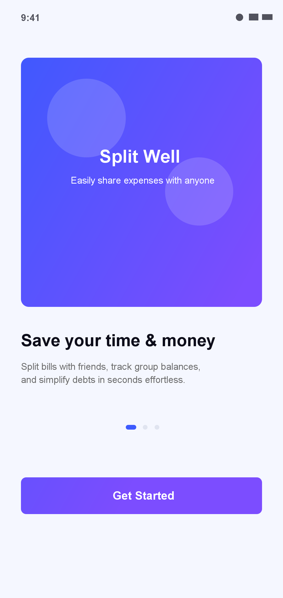
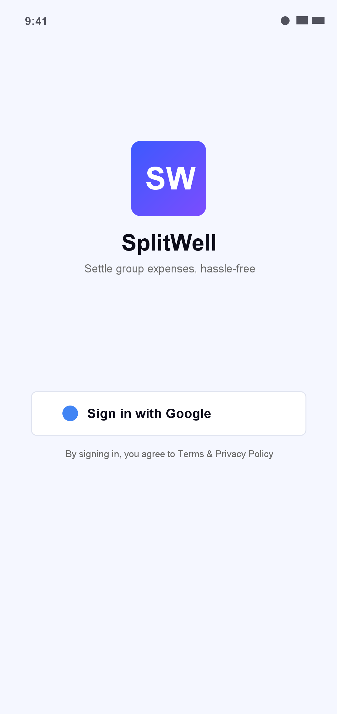
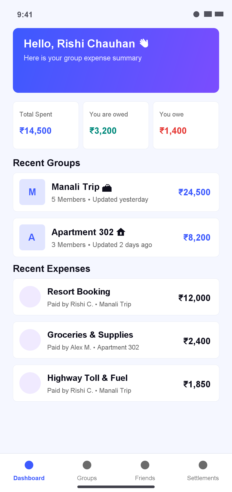
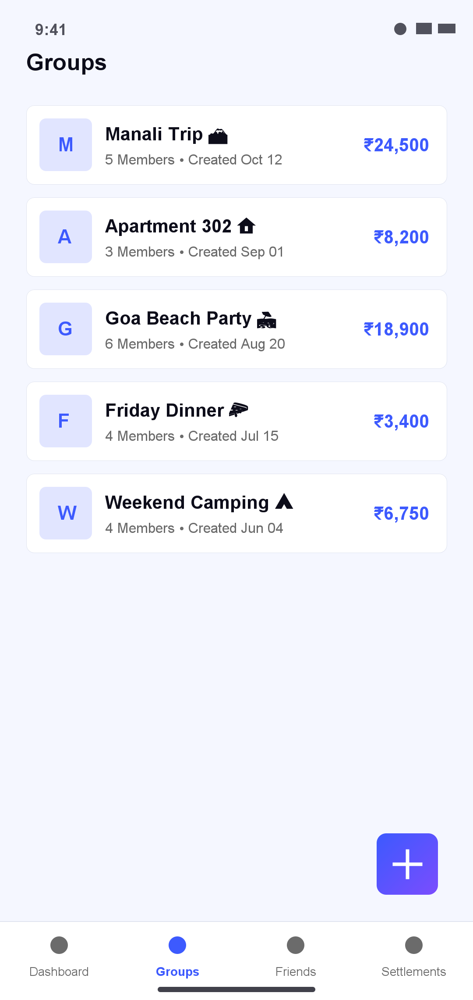
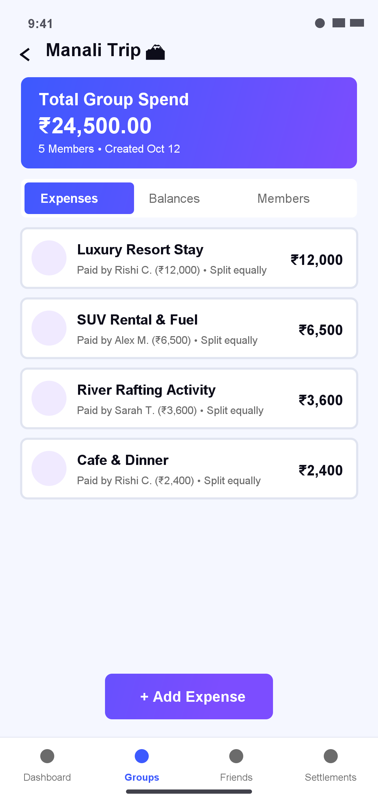
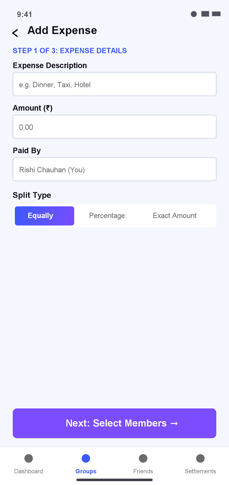
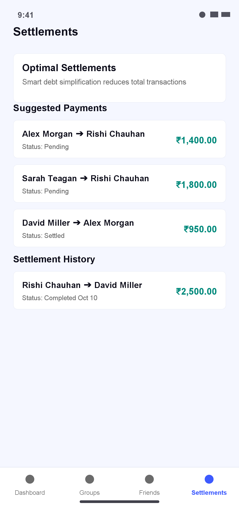

# SplitWell 💸

[](https://developer.android.com/about/versions/pie)
[](https://developer.android.com)
[](https://kotlinlang.org/)
[](https://developer.android.com/jetpack/compose)
[](#architecture--project-structure)
[](https://insert-koin.io/)
[](.github/workflows/build.yml)

**SplitWell** is a modern, intuitive, and feature-rich Android application designed for effortlessly tracking group expenses, managing shared bills, and simplifying complex interpersonal debts. Built 100% in Kotlin using Jetpack Compose (Material 3), Clean Architecture, MVVM design pattern, Koin dependency injection, and Retrofit REST APIs.

---

## 📋 Table of Contents

- [Key Features](#-key-features)
- [Screenshot Gallery](#-screenshot-gallery)
- [Tech Stack & Architecture](#-tech-stack--architecture)
- [App Navigation & UI Flow](#-app-navigation--ui-flow)
- [Debt Simplification Algorithm](#-debt-simplification-algorithm)
- [Data Synchronization Architecture](#-data-synchronization-architecture)
- [Remote REST API & Network Layer](#-remote-rest-api--network-layer)
- [Project Structure](#-project-structure)
- [Deep Linking & Invites](#-deep-linking--invites)
- [Setup & Installation](#-setup--installation)
- [CI/CD Pipeline](#-cicd-pipeline)

---

## ✨ Key Features

- 🔐 **Authentication & Onboarding**
  - Modern onboarding carousel introducing key app functions.
  - Seamless one-click Google Sign-In using Android Credential Manager & Firebase Auth.

- 📊 **Dashboard & Financial Summary**
  - Personalized greeting and quick financial overview.
  - Cards tracking **Total Spent**, **You are Owed**, and **You Owe**.
  - Quick access to recent group activities and recent expenses.

- 👥 **Group Expense Management**
  - Create and customize group spaces for trips, apartments, dinners, and events.
  - Manage group members, avatars, and group-wide financial metrics.

- 🧾 **Flexible Multi-Step Expense Creation**
  - Intuitive wizard flow (Description, Amount, Paid By, Split Method).
  - Supports equal splits, percentage-based splits, and exact custom amounts.

- ⚡ **Optimal Debt Simplification**
  - Integrated `SettlementCalculator` algorithm to simplify multi-party group debts into minimal direct transactions.
  - Track pending vs. completed settlements with a clear transaction history.

- 🔗 **Deep Linking & Instant Group Invites**
  - Custom URI scheme (`splitwell://invite`) and Web App Links (`https://pratikprajapati.cloud/invite/`) for instant group sharing and onboarding.

---

## 📸 Screenshot Gallery

| Onboarding | Login | Dashboard | Groups List |
| :---: | :---: | :---: | :---: |
|  |  |  |  |

| Group Details | Add Expense Wizard | Debt Settlements |
| :---: | :---: | :---: |
|  |  |  |

---

## 🛠️ Tech Stack & Architecture

### Technology Stack

| Layer | Technologies / Libraries Used |
| :--- | :--- |
| **Language** | Kotlin 100% |
| **UI Framework** | Jetpack Compose, Material 3, Custom Styling & Gradients |
| **Navigation** | Jetpack Compose Navigation (`androidx.navigation:navigation-compose`) |
| **Architecture Pattern** | Clean Architecture (Presentation, Domain, Data) + MVVM |
| **Dependency Injection** | Koin (`io.insert-koin:koin-androidx-compose:3.5.6`) |
| **Asynchronous Logic** | Kotlin Coroutines, Flow, StateFlow |
| **Networking** | Retrofit 3.0.0, Gson Converter, OkHttp Logging Interceptor |
| **Authentication** | Firebase Auth, Android Credential Manager, Google Identity SDK |
| **Local Data Engine** | Custom SQLite Database Engine & Query Mappers |
| **Build System & CI** | Gradle Kotlin DSL (`build.gradle.kts`), GitHub Actions |

---

## 🗺️ App Navigation & UI Flow

SplitWell utilizes a single-activity primary host (`HomeActivity`) coupled with dedicated entry activities (`IntroActivity` and `LoginActivity`) for auth and onboarding.

```text
[ IntroActivity ] ➔ [ LoginActivity ] ➔ [ HomeActivity (Main Navigation Host) ]
                                                   │
     ┌──────────────────┬──────────────────────────┼─────────────────────────┐
     ▼                  ▼                          ▼                         ▼
[ Dashboard ]    [ Groups Screen ]        [ Settlements Screen ]    [ Profile Screen ]
                        │
                        ├─► [ Group Detail Screen ]
                        │         │
                        │         ├─► [ Multi-Step Expense Wizard ]
                        │         │     ├─► Step 1: Expense Details
                        │         │     ├─► Step 2: Split Configuration
                        │         │     └─► Step 3: Confirmation
                        │         │
                        │         └─► [ Add Member Screen ]
                        │
                        ├─► [ Group Creation Screen ]
                        └─► [ Group Edit Screen ]
```

---

## ⚡ Debt Simplification Algorithm

Group expense sharing often leads to circular owing relationships (e.g., Alice owes Bob $20, Bob owes Charlie $20, Charlie owes Alice $20). SplitWell includes an in-house `SettlementCalculator` algorithm located in `domain/calculator/SettlementCalculator.kt` that reduces multi-member balance sheets to the absolute minimum number of financial transactions.

### How it Works:

1. **Calculate Net Balances**:
   For each member $i$ in a group, calculate their net balance $B_i$:
   $$B_i = \text{Total Paid by } i - \text{Total Share Owed by } i$$

2. **Separate Debtors & Creditors**:
   - Members with $B_i < 0$ are **Debtors** (they owe money).
   - Members with $B_i > 0$ are **Creditors** (they are owed money).

3. **Greedy Matching**:
   Match the largest debtor with the largest creditor to settle debts sequentially, generating `SettlementSuggestion` objects until all net balances reach zero.

#### Example Scenario:
```text
Unsimplified Transactions (6 transfers):
  - Alex ➔ Bob ($50)
  - Bob ➔ Charlie ($50)
  - Charlie ➔ Alex ($20)
  - David ➔ Alex ($30)
  - David ➔ Bob ($20)

SplitWell Simplified Result (2 transfers):
  - Alex ➔ Charlie ($30)
  - David ➔ Bob ($20)
```

---

## 🔄 Data Synchronization Architecture

SplitWell employs an **Offline-First Hybrid Synchronization** model to keep local data responsive while syncing seamlessly with remote REST services.

```text
                               ┌────────────────────────────────┐
                               │     Jetpack Compose UI         │
                               └───────────────▲────────────────┘
                                               │ StateFlow
                               ┌───────────────┴────────────────┐
                               │           ViewModel            │
                               └───────────────▲────────────────┘
                                               │ UseCase
                               ┌───────────────┴────────────────┐
                               │          Repository            │
                               └───────┬────────────────┬───────┘
                                       │                │
                         Read / Write  │                │ Remote API
                                       ▼                ▼
                           ┌──────────────┐          ┌──────────────┐
                           │ SQLite Query │          │ Retrofit API │
                           └──────────────┘          └──────────────┘
                                  ▲                         ▲
                                  └─────────┬───────────────┘
                                            │
                                  ┌───────────────────┐
                                  │   SyncManager     │
                                  │ (AppLifecycleObserver)│
                                  └───────────────────┘
```

- **`SyncManager`**: Periodically reconciles local SQLite tables (`ExpenseQuery`, `TripManagerQuery`, `UserQuery`, `SettlementQuery`) with the remote backend.
- **`AppLifecycleObserver`**: Automatically triggers background polling and synchronization whenever the application resumes from background state.

---

## 🌐 Remote REST API & Network Layer

The app communicates with remote microservices using Retrofit 3.0 and OkHttp logging interceptors. Network requests are wrapped in `Resource<T>` sealed classes to represent loading, success, and error states uniformly across the UI.

### API Endpoints Summary

| Service | Interface | Responsibilities |
| :--- | :--- | :--- |
| **Expense API** | `ExpenseApiInterface` | Create, update, delete, and fetch group expense records and expense shares. |
| **Group API** | `GroupApiInterface` | Create, update, and manage expense groups, member lists, and group details. |
| **Invite API** | `InviteApiInterface` | Generate and validate group invite links and token previews. |
| **Settlement API** | `SettlementApiInterface` | Record and retrieve settled debts between group members. |
| **User API** | `UserApiInterface` | Manage user profiles, friend connections, and registration state. |

---

## 📂 Project Structure

The project strictly adheres to **Clean Architecture** principles:

```text
com.app.splitwell/
├── data/                       # Data Layer
│   ├── local/                  # SQLite Local Database & Mappers
│   │   ├── database/           # Database Connection & Tables
│   │   ├── model/              # Local Data Entities (Expense, User, Group, Settlement)
│   │   └── query/              # SQL Queries (ExpenseQuery, UserQuery, TripsQuery)
│   ├── remote/                 # Retrofit REST API Interfaces & Data Source Implementations
│   │   ├── expense/            # Expense API & DTOs
│   │   ├── group/              # Group API & DTOs
│   │   ├── invite/             # Invite API & DTOs
│   │   ├── settlement/         # Settlement API & DTOs
│   │   └── user/               # User API & DTOs
│   ├── repository/             # Data Layer Repository Implementations
│   └── sync/                   # App Synchronization Manager & Lifecycle Observers
│
├── di/                         # Dependency Injection (Koin Container Module)
│   └── DiContainer.kt
│
├── domain/                     # Domain Layer (Pure Business Logic)
│   ├── calculator/             # SettlementCalculator Algorithm
│   ├── model/                  # Domain Business Models
│   ├── repository/             # Domain Repository Interfaces
│   └── usecase/                # Granular Business Use Cases (Expense, Group, User, Invite)
│
└── ui/                         # Presentation Layer (Jetpack Compose UI)
    ├── components/             # Reusable Design System Composables (Cards, Avatars, Buttons)
    ├── home_screen/            # Main App Screen Navigation Host & Top/Bottom Bar
    │   ├── dashboard/          # Dashboard Screen & ViewModel
    │   ├── expense/            # Expense Lists, Detail, & Multi-Step Creation Wizard
    │   ├── group/              # Groups List, Group Details, Creation & Updating
    │   ├── friend/             # Friend List Screen & ViewModel
    │   └── settlement/         # Debt Simplification & Settlement Screen
    ├── intro_screen/           # App Onboarding Pager & Intro Activity
    ├── login_screen/           # Google Sign-In & Auth Screen
    ├── invite/                 # Invite Link Preview Screen
    ├── profile/                # User Profile View & Edit Screens
    └── theme/                  # Theme Configuration, Typography, and Color Palettes
```

---

## 🔗 Deep Linking & Invites

SplitWell supports deep links for inviting members directly into groups:

- **Web Link Scheme**: `https://pratikprajapati.cloud/invite/{token}`
- **App Scheme**: `splitwell://invite?token={token}`

When a user taps an invite link, the app automatically navigates to `InvitePreviewScreen`, fetching group information before allowing the user to join with one click.

---

## 🚀 Setup & Installation

### Prerequisites

1. **Android Studio**: Android Studio Ladybug (2024.2.1) or newer.
2. **JDK**: Java Development Kit 17+.
3. **Android SDK**: Min SDK 28 (Android 9.0), Target SDK 36.
4. **Google Services**: Place a valid `google-services.json` in the `app/` directory for Firebase Authentication.

### Building & Running

1. **Clone the repository**:
   ```bash
   git clone https://github.com/rishi-chauhan-496/SplitBuddy.git
   cd SplitBuddy
   ```

2. **Configure App Properties**:
   Ensure `app/appconfig.properties` contains your keystore configurations:
   ```properties
   DEBUG_FILE_PATH=your_debug_keystore_path
   DEBUG_PASSWORD=android
   DEBUG_ALIAS=androiddebugkey
   RELEASE_FILE_PATH=your_release_keystore_path
   RELEASE_PASSWORD=your_password
   RELEASE_ALIAS=your_alias
   ```

3. **Build Debug APK**:
   ```bash
   ./gradlew assembleDebug
   ```

4. **Run Tests**:
   ```bash
   ./gradlew test
   ```

---

## ⚙️ CI/CD Pipeline

This project includes a continuous integration workflow powered by **GitHub Actions** (`.github/workflows/build.yml`):
- Triggers on every `push` to `main` or feature branches.
- Sets up Java 17 Temurin environment and caches Gradle dependencies.
- Compiles the application and generates the debug APK artifact automatically.

---

Developed with ❤️ by **Rishi Chauhan**.
